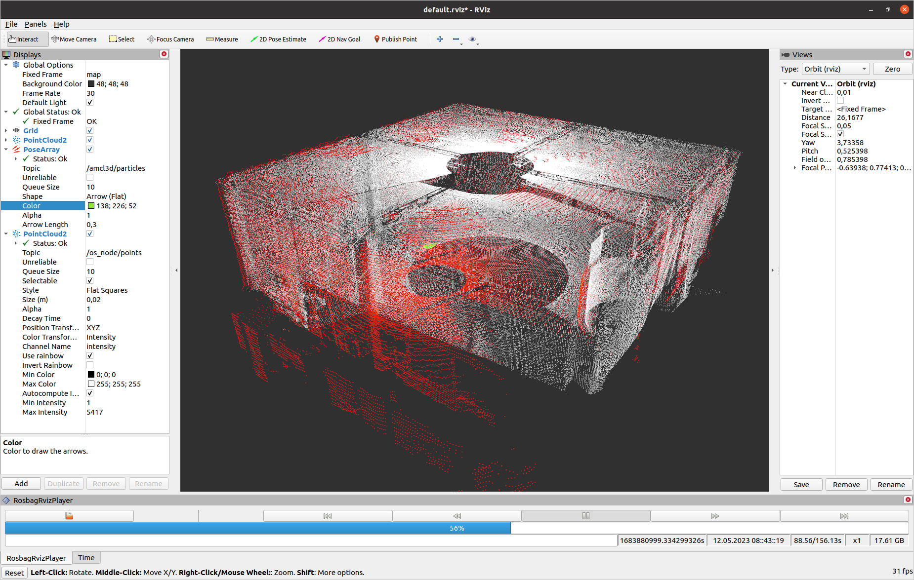

# Rosbag RViz Panel

## Overview

This package provides a custom RViz panel for playing rosbags with enhanced functionalities. The panel allows users to play rosbags forwards or backwards, adjust play speeds, while also displaying some relevant information such the date of the messages or the total size of the bag. Additionally, it features a custom progress bar that users can interact with.



## Features

- **Play Controls:** Play or pause the data at will.
- **Speed Adjustment:** Change the play speed, from -10x to 10x.
- **Information Display:**
  - Timestamp of the current playhead location.
  - Date and time of the current playhead location.
  - Number of seconds the current playhead location is from the beginning of the bag.
  - Playback speed.
  - Total size of the bag.
- **Interactive Progress Bar:** Users can interact with the custom progress bar to navigate within the rosbag.


## Dependencies installation

---

### Build essentials and cmake
```
sudo apt-get install build-essential cmake
```

### Qt5
```
sudo apt-get install qt5-default
```

### ROS(Robot Operative System)

Follow up your ROS distro installation guide: [Melodic](http://wiki.ros.org/melodic/Installation/Ubuntu) or [Noetic](http://wiki.ros.org/noetic/Installation/Ubuntu)

### (Optional) Clang-Format 16

```
sudo add-apt-repository 'deb http://apt.llvm.org/focal/ llvm-toolchain-focal main'
sudo apt update
sudo apt install clang-format-16
```

## Usage

1. Clone this repository into your ROS workspace and compile it using cmake:
    ```
    mkdir -p your_ros_ws/src && your_ros_ws/src && git clone https://github.com/fada-catec/rosbag-rviz-panel

    cd .. && catkin_make -DCMAKE_BUILD_TYPE=Release
    ```

1. Source the workspace and launch RViz:

    ```bash
    source devel/setup.zsh && rviz
    ```

2. Add the custom panel to your RViz layout:

    - Click on the "Panels" tab in RViz.
    - Select "Add New Panel" and choose it from the list.

3. Load a rosbag using the controls in the custom panel.

4. Interact with the progress bar to navigate within the rosbag.

## Help / Contribution

* Contact: **José Manuel González Marín** (jmgonzalez@catec.aero)


* Found a bug? Create an ISSUE!

* Do you want to contribute? Create a PULL-REQUEST!